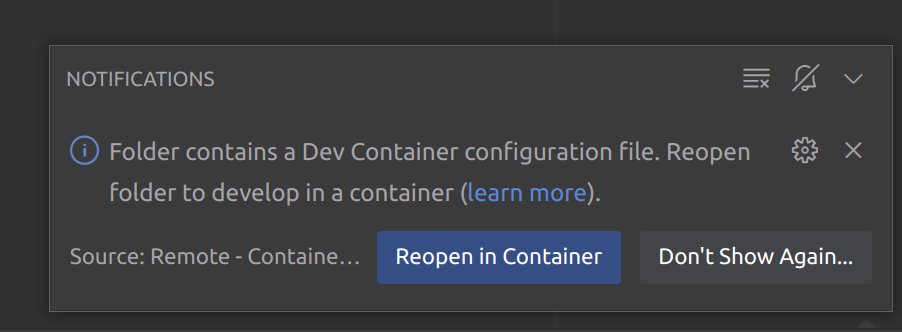

# ACS-SERVICE

Сервис для работы со СКУД контроллерами

Состоит из двух приложений:

1. `service` - сам сервис
2. `opener` - клиентское приложение, играющее роль контроллера (предназначено для ОС Linux)

## Запуск системы

Для запуска системы можно использовать несколько способов:

### VSCode:

Можно воспользоваться функциональностью Dev Container и переоткрыть папку в контейнере как показано на рисунке:

После этого в терминале для запуска сервиса набрать команду:

`cargo run -p acs-service`

Для запуска экземпляра контроллера набрать в другом терминале команду:

`cargo run -p opener -- --address=<ip> --port=8081 --serial=<serial_number> --model=<model_id>`,

где: 

* `<ip>` - ip-адрес машины в сети.
* `<serial_number>` - серийный номер контроллера (сервис отклонит подключение, если соответсвующего номера не будет в его базе).
* `<model_id>` - id модели шлагбаума (если такого не будет в базе контроллер можно будет настроить потом через API).

### Из терминала

Набрать в терминале команду `make debug_up`.

После этого открыть 2 теринала в контейнере `acs-service-rs_backend_1` с помощью `docker exec` или средствами вашей IDE.

Далее для запуска системы можно использовать команды, аналогичные первому варианту.

Для отладки и разработки сервиса в обоих случаях можно воспользоваться командой `make watch_service`

## Описание системы

[Описание системы](docs/system.md)

## Описание API

[Описание API](docs/api.md)
