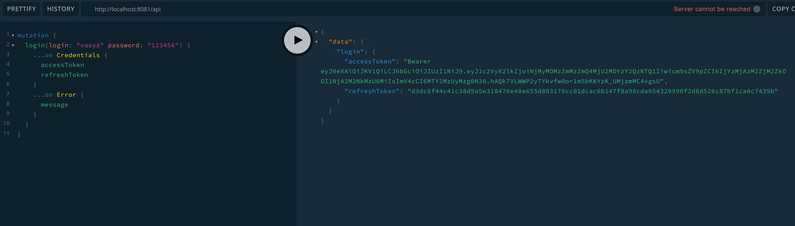
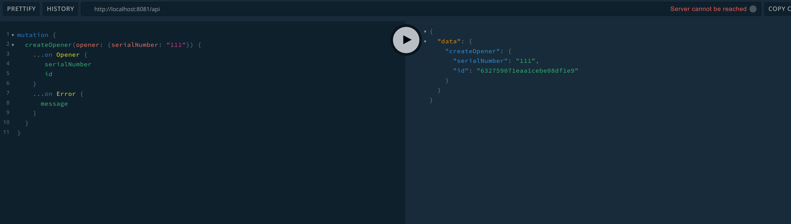
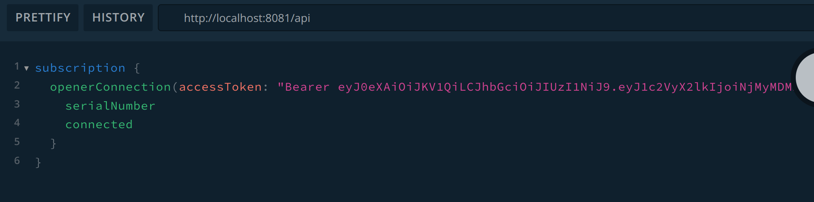
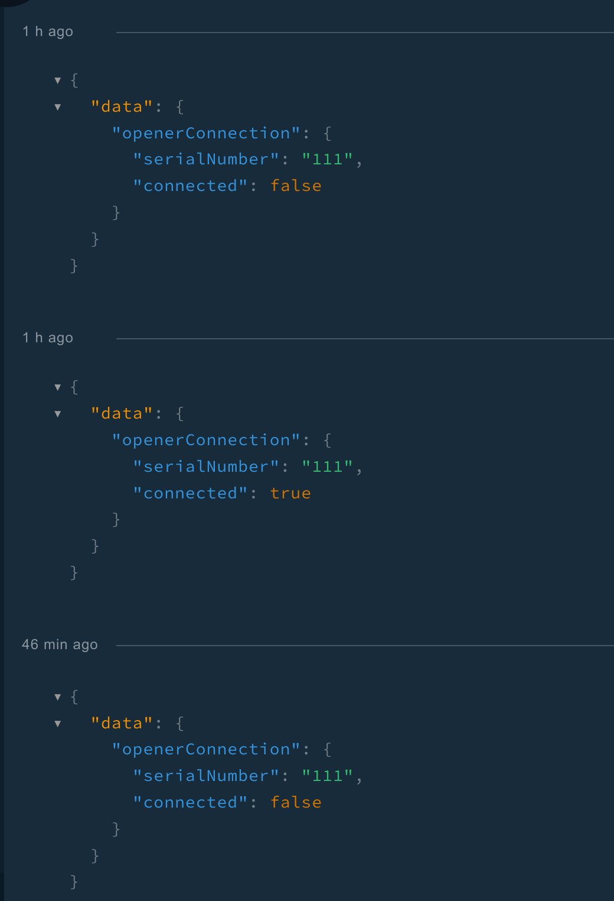
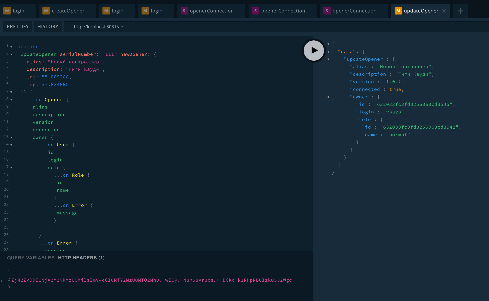
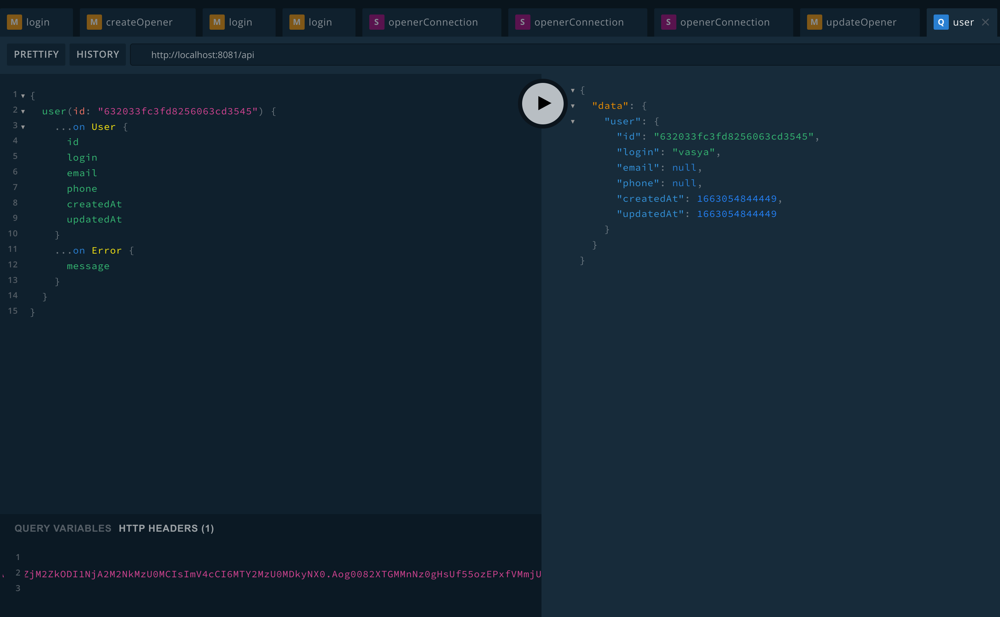

# Описание API

Реультат каждого запроса или мутации представляет собой объединение четко описывающее возможные в данной операции ошибки.
Например, вот результат мутации `createOpener`:

```graphql
union CreateOpenerResult =
    Opener
  | InternalServerError
  | UnauthorizedError
  | PermissionDeniedError
  | TokenIsExpiredError
  | AlreadyExistsError
```  

## Мутация `login`



Возвращает токен доступа и токен обновления. После истечения времени жизни токена доступа можно получить новые токены с помощью мутации `token` и полученного ранее токена продления.

## Мутация создания контроллера `createOpener`



Может использоваться только пользователями с ролями `admin` и `manufacturer`.

## Подписка `openerConnection`




Получает уведомления когда контроллер подключается к сервису или отключается от него.

## Запрос `role`


Позволяет получить информацию о роли по ее id.

## Мутация updateOpener



Позволяет изменять параметры контроллера: описании, альяс, координаты, аутентификационные данные.

Суперадмин может передать в дополнительном параметре запроса (`userId`) id пользователя для привязки контроллера к нему. Обычный пользователь не имеет права передавать этот параметр и контроллер назначается ему автоматически если он еще никому не назначен.

## Запрос `user`



Позволяет получить информацию о пользователе по его id.

## Замечания

Объекты сервиса имеют взаимосвязи между собой, что позволяет извлечь несколько сущностей один запросом (как пример см. картинку к мутации updateOpener). Эти взаимосвязи поддерживаются ресолверами для полей объектов и даталоадерами.
