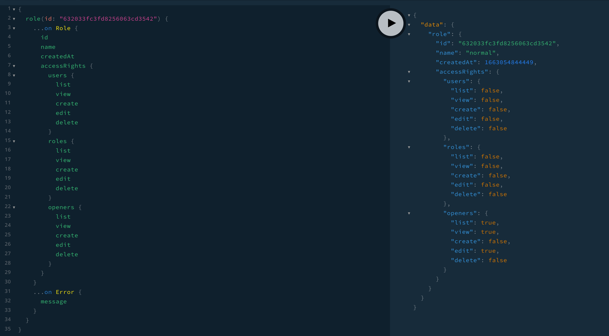
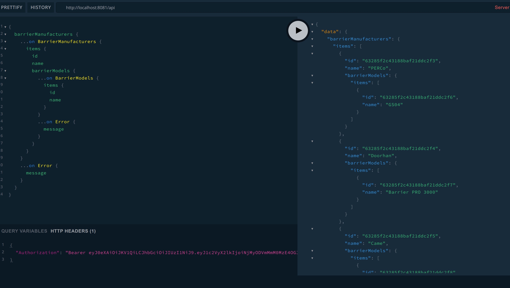
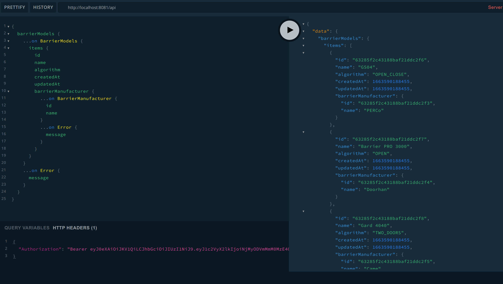
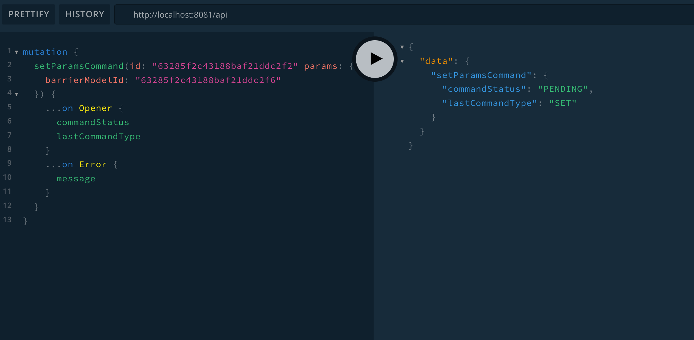
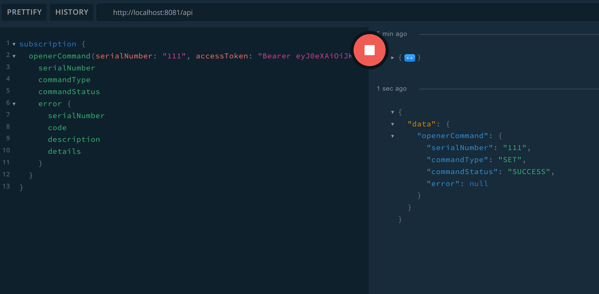

# Описание API

[Доступ к API через Playground](http://localhost:8081/playground)

Реультат каждого запроса или мутации представляет собой объединение четко описывающее возможные в данной операции ошибки.
Например, вот результат мутации `createOpener`:

```graphql
union CreateOpenerResult =
    Opener
  | InternalServerError
  | UnauthorizedError
  | PermissionDeniedError
  | TokenIsExpiredError
  | AlreadyExistsError
```  

## Мутация `login`


Возвращает токен доступа и токен обновления. После истечения времени жизни токена доступа можно получить новые токены с помощью мутации `token` и полученного ранее токена продления.

## Мутация создания контроллера `createOpener`


Может использоваться только пользователями с ролями `admin` и `manufacturer`.

## Подписка `openerConnection`


Получает уведомления когда контроллер подключается к сервису или отключается от него.

## Запрос `role`



Позволяет получить информацию о роли по ее id.

## Мутация updateOpener


Позволяет изменять параметры контроллера: описании, альяс, координаты, аутентификационные данные.

Суперадмин может передать в дополнительном параметре запроса (`userId`) id пользователя для привязки контроллера к нему. Обычный пользователь не имеет права передавать этот параметр и контроллер назначается ему автоматически если он еще никому не назначен.

## Запрос `user`


Позволяет получить информацию о пользователе по его id.

## Запрос `barrierManufacturers`



Позволяет получить список поддерживаемых производителей шлагбаумов.
Так же есть запрос `barrierManufacturer(id: ID)`, позволяющий получить производителя по его `id`.



Позволяет получить список поддерживаемых моделей шлагбаумов.
В параметре запроса можно указать в качестве фильтра `id` конкретного производителя шлагбаумов.
Так же есть запрос `barrierModel(id: ID)`, позволяющий получить модель по ее `id`.

## Мутация `setParamsCommand`



Мутация позволяет изменить параметры контроллера, которые хранятся на устройстве.
В текущей реализации позволяет задать только модель шлагбаума по ее `id`.
Приводит к отправке соответствующей команды на устройсто по веб-сокету.
Ответ на саму команду можно получить через подписку `openerCommand` или запросив данные контроллера через некоторое время.

## Подписка `openerCommand`



Позволяет отслеживать результаты обработки команд контроллером.

## Замечания

Объекты сервиса имеют взаимосвязи между собой, что позволяет извлечь несколько сущностей один запросом (как пример см. картинку к мутации updateOpener). Эти взаимосвязи поддерживаются ресолверами для полей объектов и даталоадерами.
